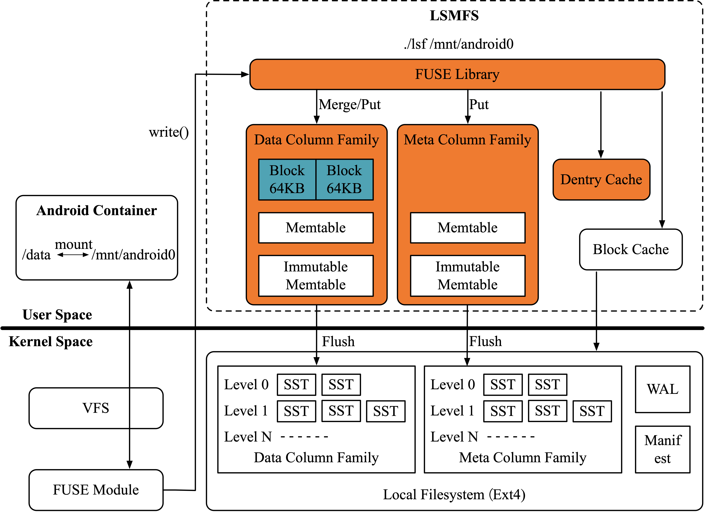

# LSMFS

A high-performance file system built on top of **LSM-tree** and **FUSE** architectures.

[🇺🇸 English](README.md) | [🇨🇳 简体中文](README.zh_CN.md)

---

## 📋 Table of Contents

- [Overview](#overview)
- [System Architecture](#System_Architecture)
- [Dependencies](#dependencies)
- [Installation](#installation)
- [Usage](#usage)
- [Compatibility](#compatibility)

---

## 📖 Overview

**LSMFS** is a custom file system leveraging [RocksDB](https://github.com/facebook/rocksdb) for storage and [FUSE](https://github.com/libfuse/libfuse) for user-space mounting. It supports high-throughput file operations and is suitable for testing or experimental environments.

---

## 🏗️ System Architecture

The following diagram illustrates the architecture of LSMFS:



---

## 📦 Dependencies

### FUSE

Install the FUSE development library:

```bash
sudo apt-get install libfuse-dev
```

### RocksDB

Install RocksDB and its dependencies:

```bash
sudo apt-get install build-essential
sudo apt-get install libsnappy-dev zlib1g-dev libbz2-dev libgflags-dev
```

Clone the RocksDB source code:

```bash
git clone https://github.com/facebook/rocksdb.git
```

------

## ⚙️ Installation

Ensure the directory structure as follows:

```
Current Directory
├── lsm_fuse     # LSMFS source code
└── rocksdb      # Cloned RocksDB source
```

Build the project:

```bash
cd lsm_fuse
./compile.sh
```

------

## 🚀 Usage

### Mount the File System

```bash
mkdir /tmp/mnt
./lsmfs /tmp/mnt mydb
```

### Interact with the File System

You can now use common commands such as `touch`, `cat`, `vi`, etc.

```bash
cd /tmp/mnt
touch testfile
cat testfile
```

### Unmount

```bash
fusermount -u /tmp/mnt
```

------

## ✅ Compatibility

- Successfully passed **8,832** file operation-related test cases using the `pjdfstests` suite.

------

## 📄 License

Licensed under the [Apache License 2.0](LICENSE).

------

## 🤝 Contributing

Contributions, issues, and feature requests are welcome!

---

## 🙏 Acknowledgements

Special thanks to [ViveNAS](https://github.com/cocalele/ViveNAS) for providing inspiration and reference for this project.

------

## 📫 Contact

If you have any questions or suggestions, feel free to open an issue or contact the maintainer.
