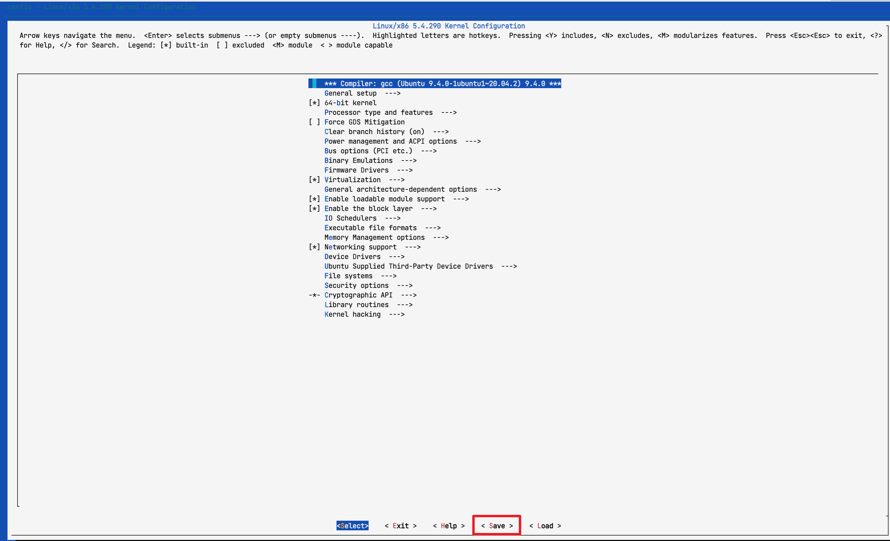
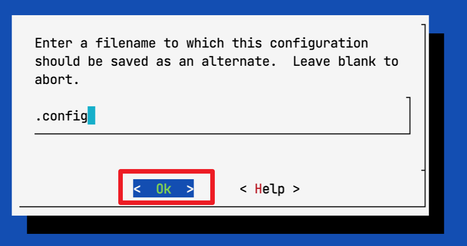

# Enable FUSE Passthrough

## Step1: patch fuse passthrough 
#### 1.1 download kernel source：
```bash
cd /usr/src/linux-5.15.98
sudo patch -p1 < fuse-passthrough-on-kernel5.15.98.patch
```
or
```bash
cd /usr/src/linux-source-5.4.0
sudo patch -p1 < fuse-passthrough-on-kernel5.4.290+.patch
```
#### 1.2 save config file
```bash
make menuconfig
```


##### 1.3 edit the .config in step 1.2
set CONFIG_SYSTEM_TRUSTED_KEYS and CONFIG_SYSTEM_REVOCATION_KEYS to empty value
#### 1.4 install the dependencies
```bash
apt install libssl-dev libncurses-dev build-essential  bison flex  libelf-dev dwavers
```
#### 1.5 compile the kernel
```bash
make -j100 && make INSTALL_MOD_STRIP=1 -j100 && make modules_install -j100 && make install -j100
```
#### 1.6 edit grub
edit /etc/default/grub and set GRUB_DEFAULT="1>0"
#### 1.7 reboot the system
```bash
update-grub && reboot
```

## Step2: demo


#### 2.1 install the dependencies
```bash
# Ubuntu/Debian
sudo apt-get install fuse3 libfuse3-dev pkg-config
```
####  2.2 fuse passthrough example
```bash
git clone https://github.com/libfuse/libfuse
cd libfuse/example
mkdir build
cd build
meson ../..
ninja
```
```bash
# create a mountpoint
mkdir ~/passthrough-fs
cd example
sudo ./passthrough ~/passthrough-fs -o allow_other
```
## step3: test

```bash
# ls
ls -l ~/passthrough-fs

# create file
echo "FUSE passthrough test" > ~/passthrough-fs/testfile.txt

# read file
cat ~/passthrough-fs/testfile.txt